# Employee Management — Docker & Kubernetes Capstone

A multi-tier **Employee Management** application taken from *runs-on-localhost* all the way to a
**production-hardened deployment on Google Kubernetes Engine (GKE Autopilot)** with GitOps via ArgoCD.

Built as the SkillfyMe Kubernetes capstone (projects **3.1 – 3.4**) and then **hardened in response to a
peer review** (8.0 → production-shaped): sealed secrets, Flyway schema control, non-root pinned images,
CPU+memory autoscaling, a single exposure path, and a dedicated ArgoCD project. See
[Security & production hardening](#security--production-hardening) for the point-by-point changes.

---

## Architecture

```
                 ┌──────────────── Kubernetes namespace: employee-app ────────────────┐
 Internet        │                                                                     │
    │            │   ┌───────────┐        ┌────────────┐        ┌──────────────────┐   │
    ▼            │   │ frontend  │  /api  │  backend   │  JDBC  │ mysql (StatefulSet│   │
 [LoadBalancer]──────►│ React +   ├───────►│ Spring Boot├────────►│  + PVC)          │   │
                 │   │ nginx     │        │ + HPA +    │        └──────────────────┘   │
                 │   │ (non-root)│        │   Flyway   │  ┌──────────────────┐         │
                 │   └───────────┘        │            ├──►│ redis (cache)     │        │
                 │                        └────────────┘  └──────────────────┘         │
                 │     ConfigMap (config)   ·   SealedSecret → Secret (DB credentials)  │
                 └─────────────────────────────────────────────────────────────────────┘
                                  ▲
                                  │ ArgoCD auto-syncs from git (AppProject: employee-app)
                          GitHub repo (k8s/ manifests, Kustomize)
```

## Tech stack

| Tier | Technology | Kubernetes workload |
|------|-----------|--------------------|
| Frontend | React 18 + Vite, served by **non-root nginx** | Deployment + LoadBalancer Service |
| Backend | Spring Boot 3.3 (Java 17), **Flyway** migrations | Deployment + ClusterIP Service + HPA |
| Cache | Redis 7 | Deployment + Service |
| Database | MySQL 8 | StatefulSet + PVC + headless Service |
| Config | ConfigMap + **SealedSecret** | — |
| GitOps | ArgoCD | Application + AppProject (auto-sync + self-heal) |

**Images on Docker Hub (non-root, pinned bases):**
`likith0129/employee-backend:1.1.0` · `likith0129/employee-frontend:1.1.0`

---

## Repository layout

```
.
├── app/
│   ├── backend/     Spring Boot API + Dockerfile.backend (non-root, pinned alpine JRE)
│   │   └── src/main/resources/db/migration/V1__init.sql   # Flyway owns the schema
│   └── frontend/    React app + Dockerfile.frontend (nginx-unprivileged, :8080) + nginx.conf
├── docker-compose.yml       Local 4-tier smoke test
├── k8s/                      # ← single source of truth, reconciled by ArgoCD
│   ├── namespace/ config/ mysql/ redis/ backend/ frontend/
│   ├── config/db-sealedsecret.yaml     # encrypted; safe to commit
│   ├── argocd/application.yaml  argocd/project.yaml
│   └── kustomization.yaml              # kubectl apply -k k8s/
├── packaging-alternative/   # Helm chart — reusable-packaging DEMO only (not deployed)
└── demos/replicaset/        # bare ReplicaSet — self-healing DEMO only (applied manually)
```

---

## Security & production hardening

Changes made in response to the review, with how each was verified on the live cluster:

| # | Area | Change | Verified |
|---|------|--------|----------|
| A1 | Secrets | Plaintext `Secret` → **Bitnami SealedSecret** (`db-sealedsecret.yaml`); plaintext removed from Git & git-ignored | `SealedSecret … SYNCED=True`; no plaintext creds in Git |
| A1 | Schema | Removed Hibernate `ddl-auto: update` → **Flyway** (`ddl-auto: validate`, `V1__init.sql`) | log: `validated 1 migration … schema version: 1` |
| A2 | Containers | **Non-root** users on **pinned** bases (`temurin:17.0.20_8-jre-alpine`, `nginx-unprivileged:1.27.5-alpine`, :8080) | `kubectl exec deploy/backend -- id` → `uid=100(app)` |
| B1 | Deploy source | Helm → `packaging-alternative/` (demo); creds stripped from `values.yaml`; ArgoCD deploys only `k8s/` | one source reconciled; no creds in values |
| B2 | ReplicaSet | Moved to `demos/replicaset/` — not part of the applied stack | `kubectl apply -k k8s/` creates no rs-demo pods |
| B3 | Autoscaling | HPA on **CPU (60%) + memory (75%)**, 2→10 | `get hpa` → `cpu: …/60%, memory: …/75%`; scale up **and** down captured |
| B4 | Exposure | Single **LoadBalancer**; Ingress removed | exactly one entry point; app reachable on LB IP |
| B5 | Redis / notes | Documented as intentional single cache (MySQL is source of record) | see [Design notes](#design-notes) |
| B6 | GitOps | Dedicated **AppProject** `employee-app` (scoped repo + namespace); Application moved off `default` | app **Synced / Healthy**; drift self-heals |

---

## Phase 1 — Dockerise (local smoke test)

Multi-stage Dockerfiles for both tiers, wired together with `docker-compose` to prove the images talk before Kubernetes.

```bash
docker compose up --build      # app at http://localhost:8085
```

| Images built | Containers running |
|---|---|
| 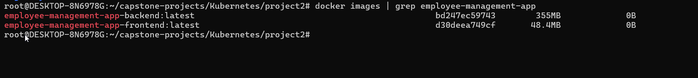 | 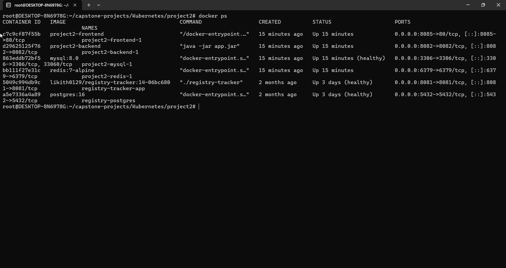 |

| App on localhost | Backend health & logs |
|---|---|
| 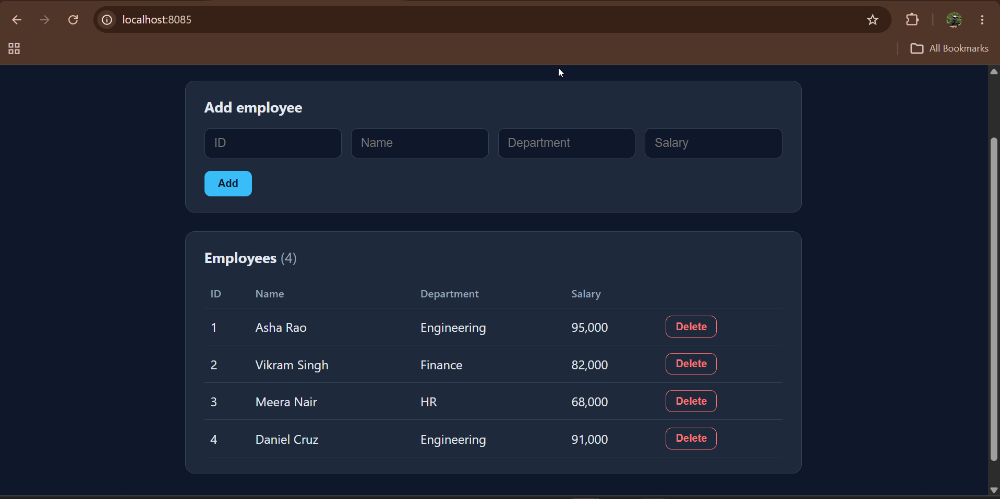 | 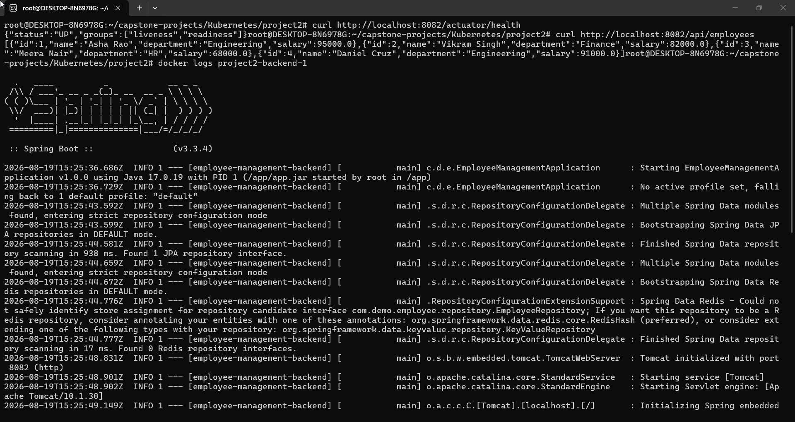 |

---

## Project 3.1 — ReplicaSets & Deployments

Deployments manage the app pods; a bare ReplicaSet (now in `demos/replicaset/`) demonstrates self-healing, plus scaling, rolling updates and rollback.

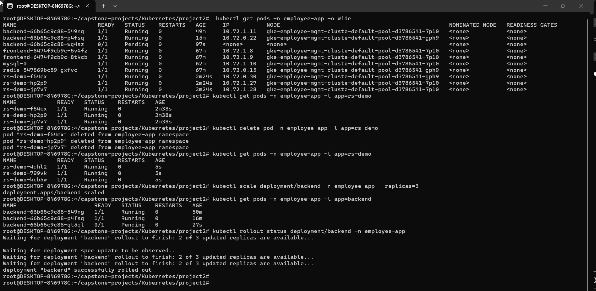
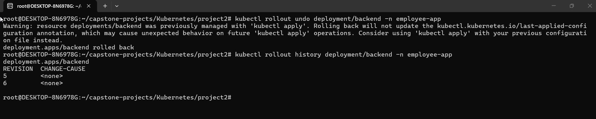

---

## Project 3.2 — Resource Management & Horizontal Pod Autoscaling

CPU/memory **requests & limits** on every pod, plus an **HPA** on the backend scaling on **CPU 60% and memory 75%** (2 → 10 replicas), with a `startupProbe` so cold starts aren't mistaken for failures.

| HPA (CPU + memory) | Backend HPA detail |
|---|---|
| 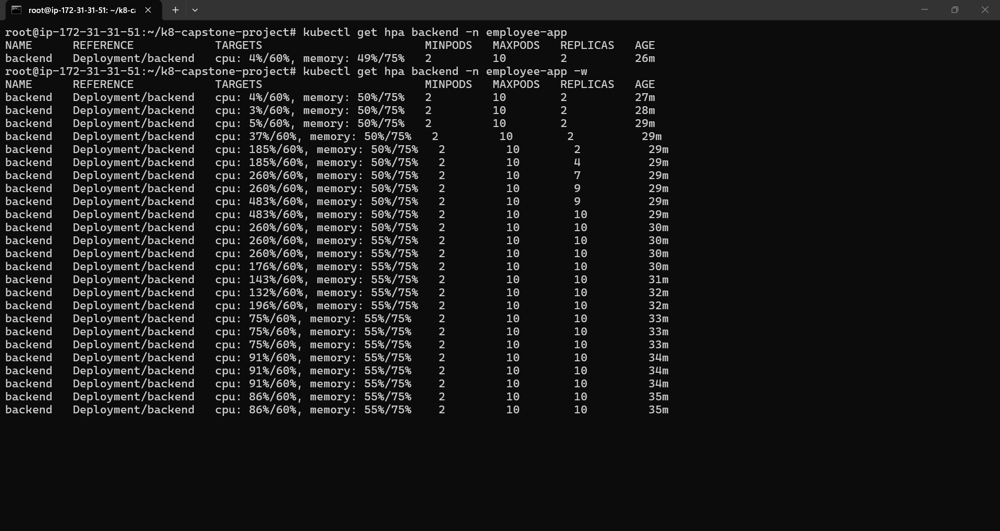 | 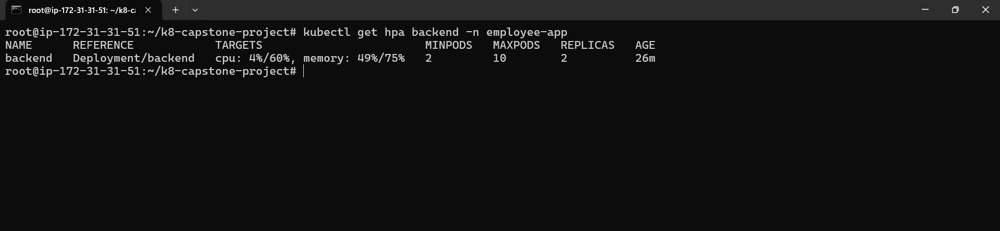 |

**Scale-up *and* scale-down under load:**

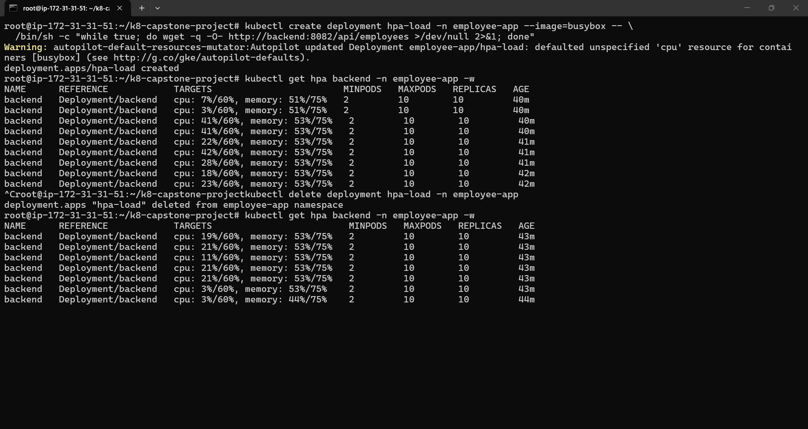

**Autopilot provisioning nodes on demand during scale-up:**

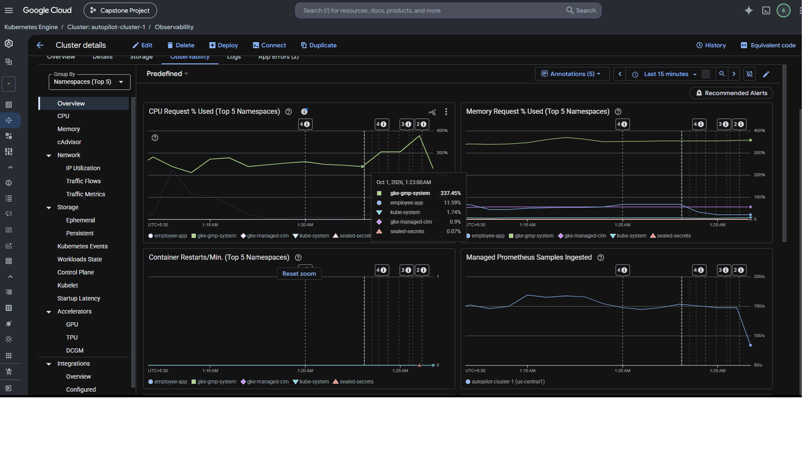

---

## Project 3.3 — PV, ConfigMap, Secrets & Services

MySQL on a **StatefulSet + PersistentVolumeClaim** (data survives restarts), backend config from a
**ConfigMap**, DB credentials from an encrypted **SealedSecret**, and the app exposed through a single
**LoadBalancer Service**.

| App via Kubernetes | External LoadBalancer |
|---|---|
| 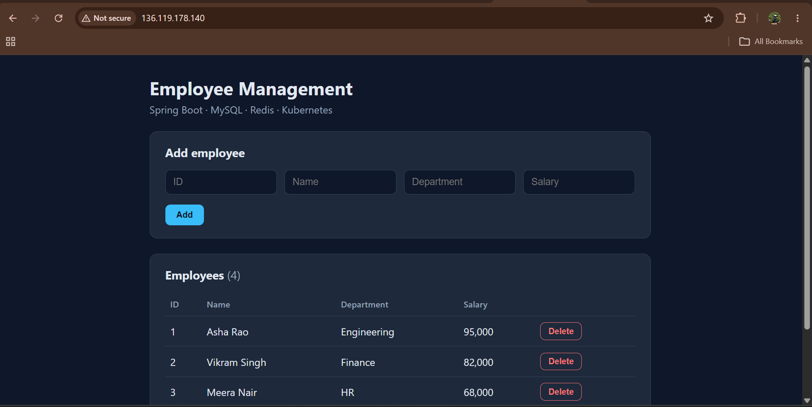 | 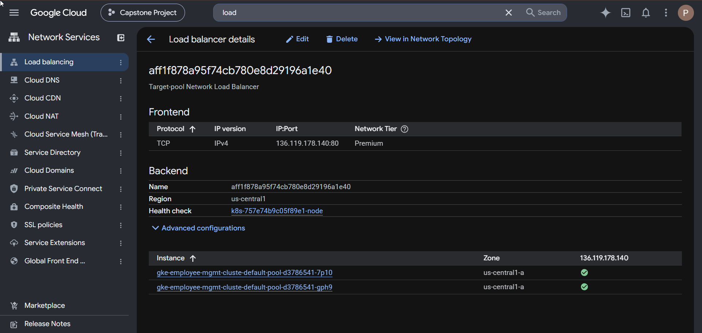 |

Deploy the whole stack in one command:

```bash
kubectl apply -k k8s/
```

---

## Project 3.4 — GitOps with ArgoCD

`k8s/` is the single source of truth. ArgoCD (scoped to the `employee-app` AppProject) watches this repo and
keeps the cluster in sync (auto-sync + self-heal). Backend `/spec/replicas` is in `ignoreDifferences` so GitOps
and the HPA don't fight.

**GKE cluster:**

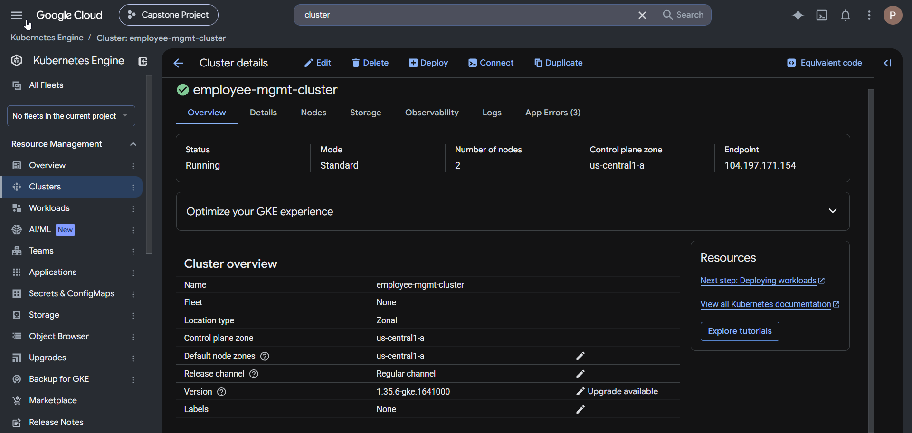

| ArgoCD application | ArgoCD network flow & sync |
|---|---|
| 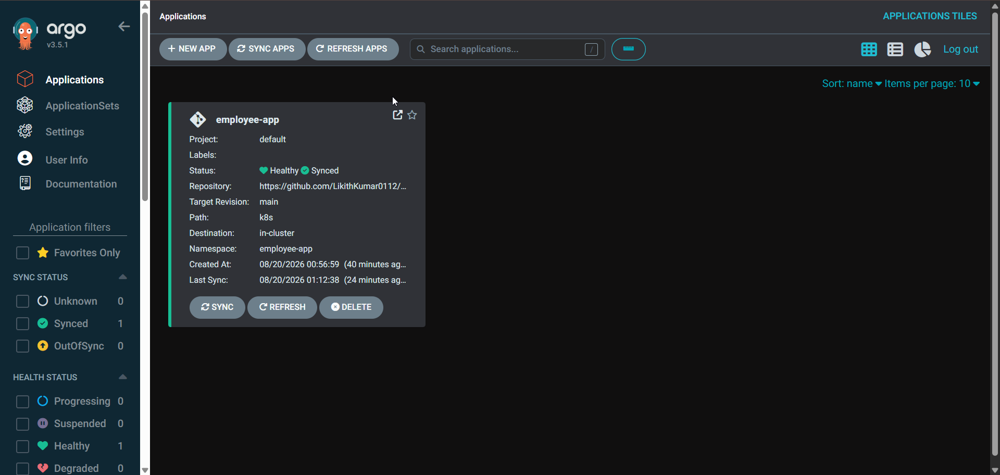 | 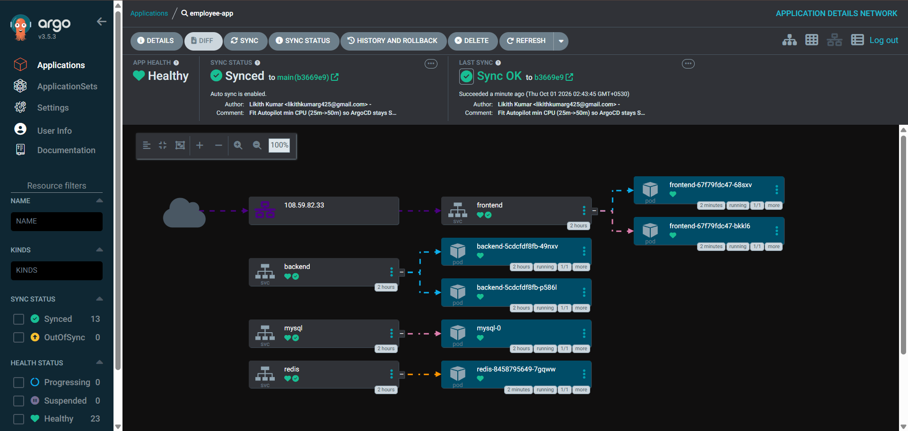 |

```bash
kubectl apply -f k8s/argocd/project.yaml
kubectl apply -f k8s/argocd/application.yaml
```

---

## Running it yourself

```bash
# Local (Docker)
cp .env.example .env           # then set your local DB passwords
docker compose up --build

# Kubernetes (from a configured kubectl context)
# 1. install the sealed-secrets controller (own namespace on Autopilot):
helm repo add sealed-secrets https://bitnami.github.io/sealed-secrets && helm repo update
helm install sealed-secrets sealed-secrets/sealed-secrets -n sealed-secrets --create-namespace \
  --set-string fullnameOverride=sealed-secrets-controller --set rbac.serviceProxier.create=false
# 2. deploy the stack:
kubectl apply -k k8s/
kubectl get pods -n employee-app -w
kubectl get svc frontend -n employee-app        # grab EXTERNAL-IP

# Tear down (stop cloud charges)
kubectl delete -k k8s/
gcloud container clusters delete <cluster> --region <region>
```

> **Regenerating the sealed secret** (each controller has its own key, so seal against the cluster that will
> decrypt it): `kubectl create secret generic db-secret -n employee-app --from-literal=... --dry-run=client -o yaml
> | kubeseal --controller-name=sealed-secrets-controller --controller-namespace=sealed-secrets --format yaml
> > k8s/config/db-sealedsecret.yaml`

## Design notes

- **Secrets:** DB credentials live **only** in the encrypted `SealedSecret` (safe in Git); the sealed-secrets
  controller decrypts them into a real `Secret` in-cluster. No plaintext credentials in the deployed manifests.
- **Schema:** owned by **Flyway** (`ddl-auto: validate`) for deterministic, versioned migrations.
- **Redis:** an intentional single, non-persistent cache — MySQL is the system of record, so a cache restart
  loses nothing. Production would use GCP Memorystore or a replicated Redis.
- **Deployment source of truth:** `k8s/` (Kustomize) via ArgoCD. The Helm chart under `packaging-alternative/`
  is a reusable-packaging demo only.
- **Exposure:** a single LoadBalancer Service on the frontend (Ingress removed to avoid competing entry points).
- **GKE Autopilot:** manifests declare Autopilot-compatible resource requests (min 50m CPU) so ArgoCD stays
  cleanly Synced despite Autopilot's resource-defaulting webhook.
