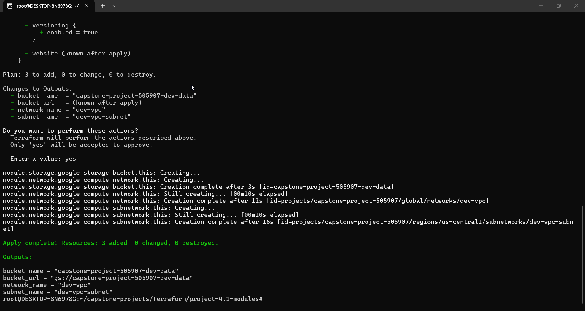
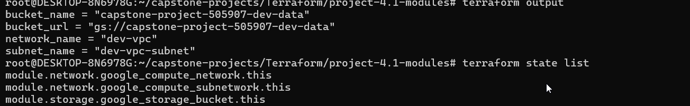
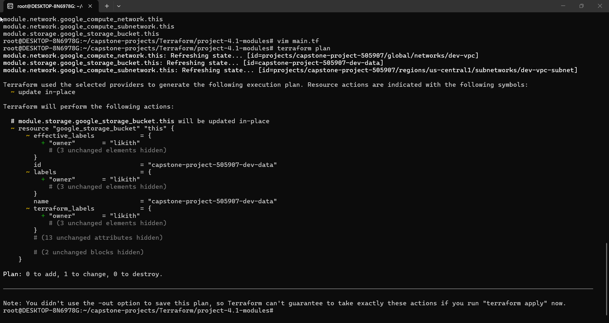
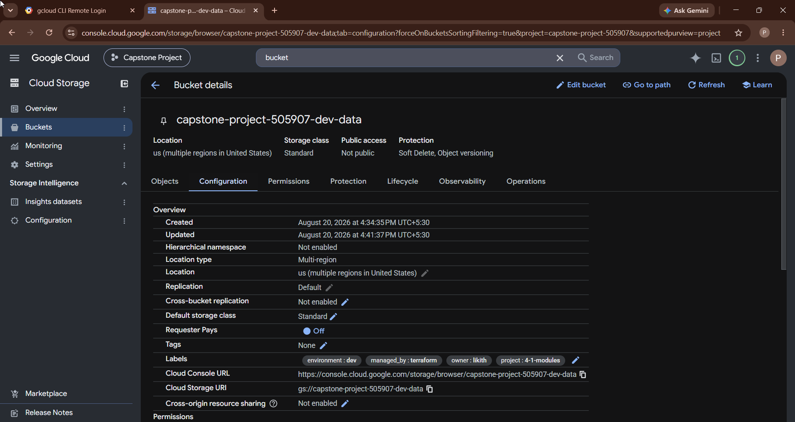
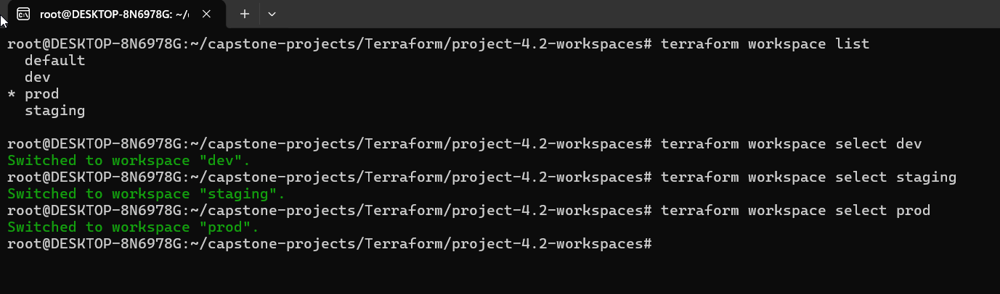
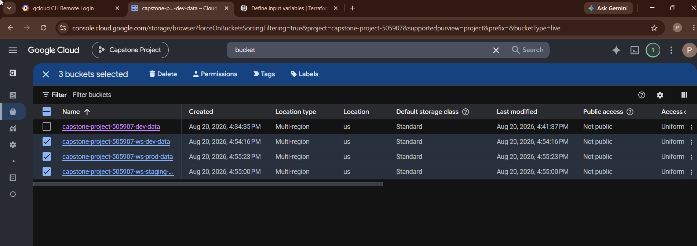
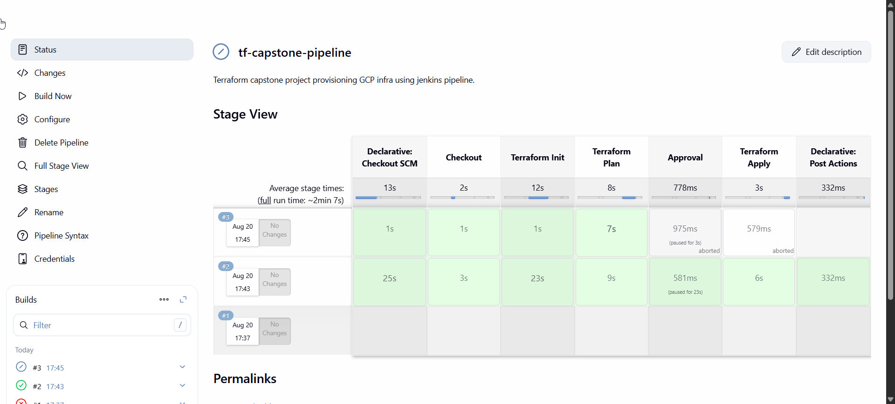
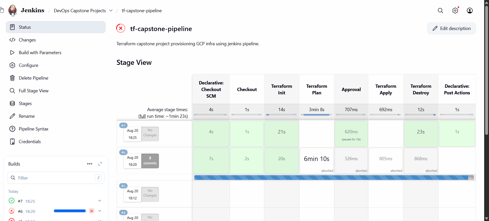
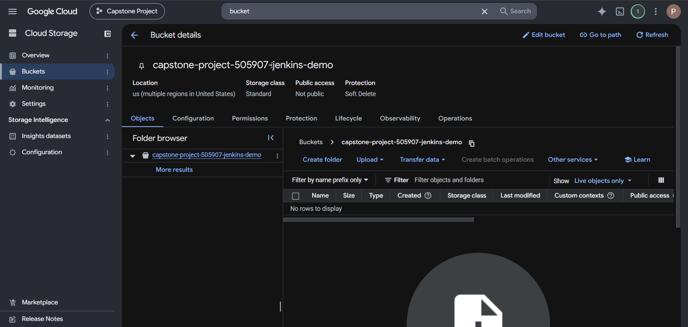

# Terraform Capstone — Infrastructure as Code (Projects 4.1 – 4.4)

Four progressive Infrastructure-as-Code projects taking Terraform from **reusable
modules** through **multi-environment workspaces** and a **Jenkins CI/CD pipeline**,
finishing with **Kubernetes monitoring** using Prometheus & Grafana.

All cloud resources are provisioned on **Google Cloud Platform (GCP)**; the
monitoring stack runs on a local `kind` cluster to keep it off the cloud bill.

| # | Project | Folder | Core skill demonstrated |
|---|---------|--------|-------------------------|
| 4.1 | Modules, Outputs & State | [`project-4.1-modules/`](project-4.1-modules/) | Reusable modules, output variables, state inspection |
| 4.2 | Multiple Environments | [`project-4.2-workspaces/`](project-4.2-workspaces/) | `terraform workspace` — isolated dev / staging / prod |
| 4.3 | Terraform + Jenkins | [`project-4.3-jenkins/`](project-4.3-jenkins/) | CI/CD pipeline for IaC (apply/destroy with approval gate) |
| 4.4 | Prometheus + Grafana | [`project-4.4-monitoring/`](project-4.4-monitoring/) | Kubernetes observability via `kube-prometheus-stack` |

---

## Repository structure

```
Terraform/
├── modules/                 # shared, reusable Terraform modules
│   ├── gcs-bucket/          #   a GCS bucket
│   └── network/             #   a VPC + subnet
├── project-4.1-modules/     # calls the modules, exposes outputs, inspects state
├── project-4.2-workspaces/  # same config across dev / staging / prod workspaces
├── project-4.3-jenkins/     # Jenkinsfile + terraform/ provisioned by CI/CD
├── project-4.4-monitoring/  # kube-prometheus-stack on a local kind cluster
└── screenshots/             # deliverable evidence (embedded below)
```

Each project folder has its own detailed README with the exact commands to run.

---

## Design choices

- **GCP** for continuity with the earlier Kubernetes capstone (`gcloud auth
  application-default login` for local auth; a service-account JSON key for Jenkins).
- **Lightweight resources** (GCS buckets, VPC) — free / near-free and quota-friendly.
  The Terraform *concepts* are identical whether the resource is a bucket or a VM.
- **Remote state in GCS** is provided as an elevate step (`backend-gcs.tf.example`).
- **4.4 runs on a local `kind` cluster** — free, and keeps monitoring off the cloud bill.

## Prerequisites

```bash
# Terraform, gcloud, kubectl, helm, kind, docker installed and on PATH
gcloud auth application-default login
gcloud config set project <YOUR_PROJECT_ID>
```

---

## Project 4.1 — Modules, Outputs & State

Two reusable modules (`modules/gcs-bucket`, `modules/network`) are called from
`main.tf` to create a GCS bucket and a VPC + subnet. Outputs expose the created
resource names, and the state file is inspected and re-applied after a change.

```bash
cd project-4.1-modules
terraform init && terraform apply     # create the infrastructure
terraform output                      # exposed output values
terraform state list                  # every resource Terraform tracks
```

**`terraform apply` — modules provisioning the bucket + network**


**`terraform output` and `terraform state list`**


**State-drift detection — `plan`/`apply` after a config change**


**Resulting bucket in the GCP console**


---

## Project 4.2 — Multiple Environments with Workspaces

One configuration, three isolated environments — each with its **own state file**
under `terraform.tfstate.d/<workspace>/`, using `terraform workspace`.

```bash
cd project-4.2-workspaces
terraform workspace new dev && terraform workspace new staging && terraform workspace new prod
terraform workspace select dev && terraform apply
# repeat select/apply for staging and prod
```

**`terraform workspace list` / selecting workspaces**


**Separate `-dev-`, `-staging-`, `-prod-` buckets in GCP — proof of isolation**


---

## Project 4.3 — Infrastructure Automation with Terraform + Jenkins

A parameterised Jenkins pipeline ([`Jenkinsfile`](project-4.3-jenkins/Jenkinsfile))
that runs Terraform to **apply** or **destroy** GCP infrastructure, with a manual
approval gate. Stages: `Checkout → Init → Plan → Approval → Apply / Destroy`.
GCP auth uses a service-account key stored as a Jenkins **Secret file** credential
(`gcp-sa-key`).

**Pipeline stage view in Jenkins**


**Parameterised run — `apply` / `destroy` choice with approval**


**Infrastructure created by the pipeline (bucket in GCP)**


---

## Project 4.4 — Kubernetes Monitoring with Prometheus & Grafana

A full observability stack (Prometheus + Grafana + node-exporter +
kube-state-metrics) deployed onto a local `kind` cluster via the
`kube-prometheus-stack` Helm chart, tuned in `values.yaml` for a small 2-node
cluster. See the [project README](project-4.4-monitoring/README.md) for the
tuning story and troubleshooting notes.

```bash
cd project-4.4-monitoring
kind create cluster --name monitoring --config kind-config.yaml
helm install kps prometheus-community/kube-prometheus-stack -n monitoring -f values.yaml
kubectl port-forward -n monitoring svc/kps-grafana 3001:80   # admin / admin123
```

**All stack pods `Running` in the `monitoring` namespace**


**Grafana dashboard (Node Exporter Full, ID 1860) — live CPU / memory / node metrics**


---

## Notes

- Secrets are kept out of git: `*.tfvars`, `*.tfstate`, `.terraform/` and any
  service-account key (`*sa-key*.json`) are `.gitignore`d; `*.tfvars.example`
  templates are committed instead.
- The manual's index lists 4.3 as "Ansible / Dynamic Inventory", but every 4.3
  detail page describes **Terraform + Jenkins** — this repo follows the detailed
  task pages.

## Author

**Likith Kumar** — SkillfyMe Enterprise Capstone (Terraform / IaC track).
