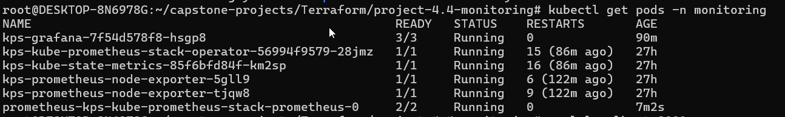
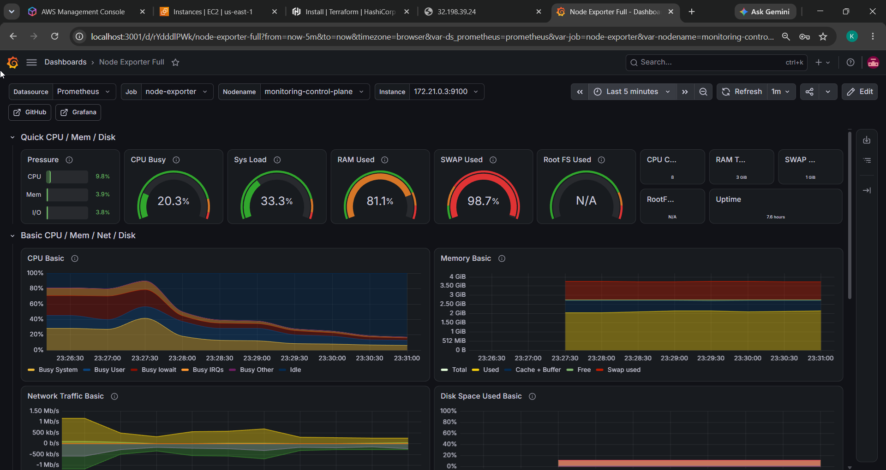

# Monitoring Kubernetes with Prometheus & Grafana

> Capstone Project 4.4 — deploy a full observability stack (Prometheus + Grafana + node-exporter + kube-state-metrics) onto a Kubernetes cluster using the `kube-prometheus-stack` Helm chart, and visualise cluster health with community dashboards.

## Overview

This project stands up a local Kubernetes cluster with [kind](https://kind.sigs.k8s.io/) and installs the [`kube-prometheus-stack`](https://github.com/prometheus-community/helm-charts/tree/main/charts/kube-prometheus-stack) Helm chart. That single chart wires together:

- **Prometheus** — scrapes and stores cluster metrics
- **Grafana** — dashboards, pre-configured with Prometheus as a data source
- **node-exporter** — per-node CPU / memory / disk / network metrics
- **kube-state-metrics** — Kubernetes object state (pods, deployments, nodes)
- **Prometheus Operator** — manages the Prometheus/Grafana lifecycle

The result: live dashboards showing CPU usage, memory consumption, pod status and node resource utilisation.

## Feature status
| Feature | Status | Notes |
|---------|--------|-------|
| Prometheus + Grafana + node-exporter + kube-state-metrics | **Implemented** | via `kube-prometheus-stack` |
| Grafana admin creds from a Kubernetes Secret | **Implemented** | `existingSecret: grafana-admin` (no plaintext password in `values.yaml`) |
| Grafana persistence (dashboards survive restarts) | **Implemented** | 5Gi PVC |
| Prometheus persistence | **Implemented** | 10Gi `storageSpec` PVC |
| Prometheus retention 15d | **Implemented** | was 6h |
| Alertmanager | **Implemented** | `alertmanager.enabled: true` |
| Dashboards provisioned as code | Optional | currently imported manually (ID 1860) |

## Architecture

```
┌──────────────────────── kind cluster (monitoring) ────────────────────────┐
│                                                                            │
│   node-exporter ───┐                                                       │
│                    ├──►  Prometheus  ──►  Grafana  ──►  port-forward ──────►│  http://localhost:3001
│ kube-state-metrics ┘       (scrape)      (dashboards)                      │  (admin / from Secret)
│                                                                            │
│   control-plane node   +   worker node                                     │
└────────────────────────────────────────────────────────────────────────────┘
```

## Tech stack

| Tool | Purpose |
|------|---------|
| Docker | Container runtime hosting the kind nodes |
| kind | Local Kubernetes cluster |
| kubectl | Kubernetes CLI |
| Helm | Installs the `kube-prometheus-stack` chart |
| Prometheus | Metrics collection & storage |
| Grafana | Metrics visualisation / dashboards |

## Repository structure

```
project-4.4-monitoring/
├── kind-config.yaml          # 2-node kind cluster (1 control-plane + 1 worker)
├── values.yaml               # tuned Helm values for a small local cluster
├── kube-prometheus-stack/    # vendored Helm chart
├── SETUP.md                  # step-by-step setup on a fresh Linux machine
├── screenshots/              # deliverable screenshots (see below)
└── README.md
```

## Prerequisites

Docker, kind, kubectl and Helm installed and on your `PATH`, with the Docker daemon running. Full install commands for a fresh Linux machine are in [`SETUP.md`](./SETUP.md).

```bash
docker --version && kind --version && kubectl version --client && helm version
```

## Quick start

### 1. Create the cluster
```bash
kind create cluster --name monitoring --config kind-config.yaml
kubectl get nodes          # both nodes should be Ready
```

### 2. Install the monitoring stack
```bash
helm repo add prometheus-community https://prometheus-community.github.io/helm-charts
helm repo update

kubectl create namespace monitoring

# Grafana admin creds come from a Secret (values.yaml uses existingSecret: grafana-admin)
kubectl create secret generic grafana-admin -n monitoring \
  --from-literal=admin-user=admin \
  --from-literal=admin-password='<STRONG_PASSWORD>'

helm install kps prometheus-community/kube-prometheus-stack -n monitoring -f values.yaml

kubectl get pods -n monitoring -w      # wait until everything is Running / Ready
```

### 3. Open Grafana
```bash
kubectl port-forward -n monitoring svc/kps-grafana 3001:80
# browse http://localhost:3001   (login: admin / the password you set in the grafana-admin Secret)
```

### 4. Import a dashboard
In Grafana: **Dashboards → New → Import → ID `1860`** (Node Exporter Full) → select the **Prometheus** data source → **Import**.

## Screenshots / Deliverables

**All stack pods running** (`kubectl get pods -n monitoring`) — Prometheus, Grafana, node-exporter and kube-state-metrics all `Running`:



**Grafana monitoring dashboard** (Node Exporter Full, ID 1860) — live CPU, memory and pod/node metrics, backed by Prometheus:



## Configuration notes (`values.yaml`)

The chart defaults assume a beefy cluster. `values.yaml` trims and tunes it to run reliably on a small 2-node local cluster, while keeping production-oriented hardening:

- **Grafana admin from a Secret** (`existingSecret: grafana-admin`) — no plaintext password in `values.yaml`.
- **Grafana persistence** (5Gi PVC) so dashboards survive pod restarts.
- **Alertmanager enabled** so alerts can actually fire.
- **Prometheus** retention raised to **15d** with a **10Gi PVC** so metrics persist across restarts.
- **Grafana** given `1` CPU / `1Gi` memory and patient health probes — the defaults throttled its (slow) startup and OOM-killed it, causing a `CrashLoopBackOff`.
- **Prometheus** given `1` CPU / `1Gi` memory so its readiness probe doesn't time out under CPU throttling.

See the [Troubleshooting](#troubleshooting) section for the story behind those values.

## Troubleshooting

Issues actually hit while building this, and their fixes:

| Symptom | Cause | Fix |
|---------|-------|-----|
| `kubectl get nodes` → *connection refused* | kind containers stopped after a Docker/host restart | `docker start monitoring-control-plane monitoring-worker`, or `kind export kubeconfig --name monitoring` |
| `No space left on device` installing Helm | small (8 GiB) root volume | Grow the volume, then `sudo growpart /dev/nvme0n1 1 && sudo resize2fs /dev/nvme0n1p1` |
| `Cannot connect to the Docker daemon` | Docker not running | `sudo systemctl enable --now docker` |
| Grafana pod stuck `2/3`, `CrashLoopBackOff` | CPU limit too low → liveness probe killed it mid-boot | Raise CPU limit + relax probes (in `values.yaml`) |
| Grafana pod `OOMKilled` (exit 137) after ~90 min | 512Mi memory limit too small for Grafana 13.x | Raise memory limit to `1Gi` |
| Prometheus pod stuck `1/2` | CPU throttling → `/-/ready` probe timeout | Raise Prometheus CPU/memory limits |

## Clean up

```bash
helm uninstall kps -n monitoring
kind delete cluster --name monitoring
```

## Possible extensions

- Add Prometheus alert rules for high CPU / memory (Alertmanager is already enabled).
- Import additional dashboards (e.g. **315** Kubernetes cluster monitoring), or provision them as code via `grafana.dashboardProviders`.
- Expose Grafana via an Ingress instead of `port-forward`.
